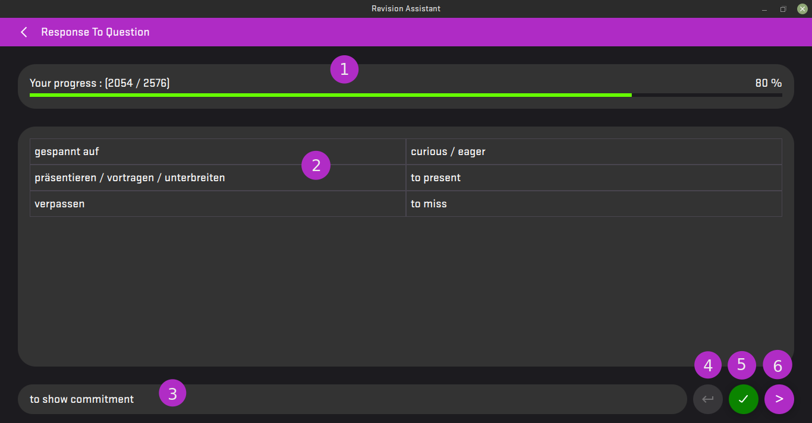
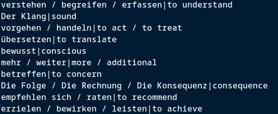

# Revision Assistant

Revision Assistant is an application that gives some random questions (or responses) from a dictionary configured by the user, and the user should answer with the corresponding answer (or question respectively). It also tracks the current progression and gives the user the possibility to mark a question/response as `completed` so it doesn't get selected randomly.

Currently, the application is still in Beta and it is cross-platform:

-   Windows 10
-   Linux (Ubuntu 20.04)
-   Android 8
-   [Web](https://revision-assistant.vercel.app) (modern browser with WASM support required)

## Dictionaries

Revision Assistant uses the concept of `Dictionaries` to differentiate different data sources.

Each `Dict` holds a set of questions and their answers, along with their progression (completed or not).

All `Dict`s are independent of each other. Users can have multiple dictionaries at the same time and add new data sets easily without altering other dictionaries.

## One-To-One Association

Each entry of a `Dict` consists of a single question with a single response. This is a One-To-One Association, which means each question has exactly one response, and that response has exactly that question.

Many-To-Many Association is not currently supported. However, based on your criteria, you can transform it into a One-To-One Association by combining all the 'many' elements from each side. For example, `question1 / question2 | response1 / response2`. Here, the application will display `question1 / question2` entirely, and the user is expected to answer with `response1 / response2`.

## Modes

Currently, the application has 2 modes:

-   `Q to R` Question to Response: The application will select a random question and the user should guess the response.
-   `R to Q` Response to Question: The application will select a random response and the user should guess the question.

## Progression

Initially, all entries (question/response) are marked as `not completed`. When you complete an entry, you can mark it as `completed` so the entry will not be selected randomly. You can undo that at any time.

Since the application has 2 modes (Q to R or R to Q), the progression is tracked both ways.

## Quiz Page Interface

The following interface represents an example of a dictionary for learning German. The entries are words from English and German that have similar meanings.

1. Current progress
2. History of previous questions and their responses
3. Current question to answer
4. If you marked a question as `completed` but then realized that your answer wasn't correct, you can undo this action by clicking on this button.
5. If the user knows 99% of the answer to the current question, he can mark it as `completed`, and the next question will be issued automatically.
6. Skip to the next question without marking the current question as `completed`. The question and the response will be shown in the history field.

## New Dictionary Example

Example: A German Dict that associates words from German to the corresponding words in English with similar meanings.

To accomplish that, create a `.txt` file and fill each line with an entry, where each line is divided by a separator of your choice. The separator will help the application distinguish which is the question and which is the response.

In my example, I chose `|` as the separator. Each line must have exactly 1 separator. The left side of the separator is considered the `question`, and the right side is the `response`.

After creating the text file, you can import it into the application by specifying both the location of the text file and the chosen separator.

# Credits

-   [Qt Framework](https://www.qt.io/) for providing an easy way to code GUI applications on multiple platforms
-   [flaticon.com](https://www.flaticon.com/) for logo icons
